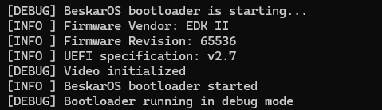
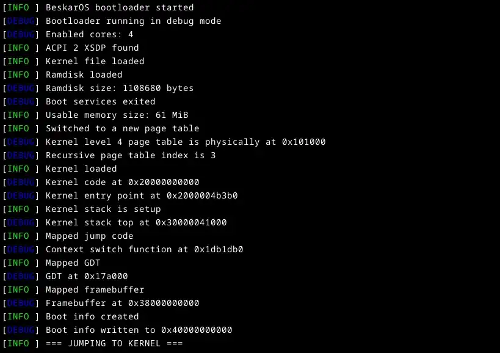
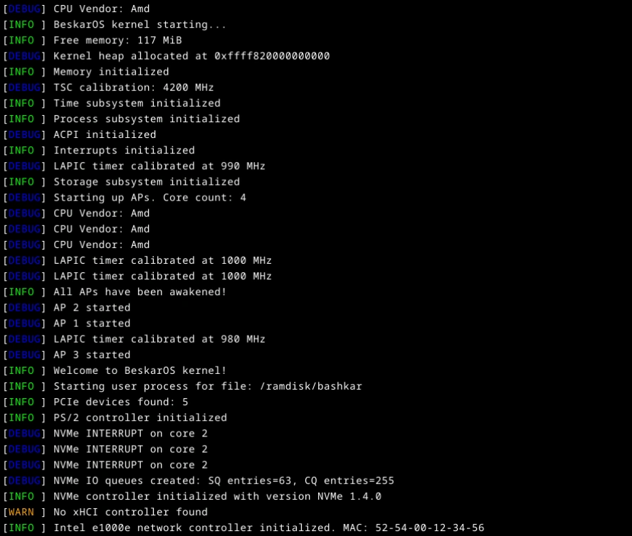
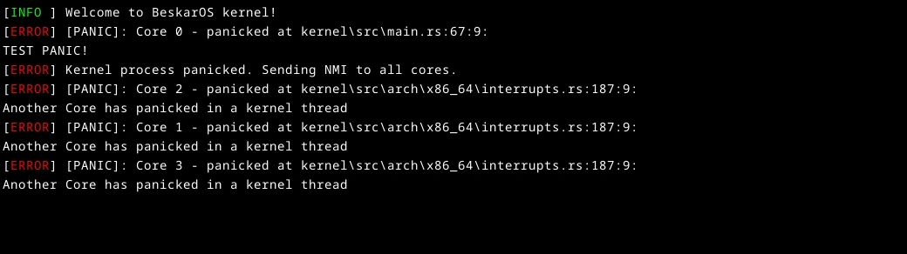
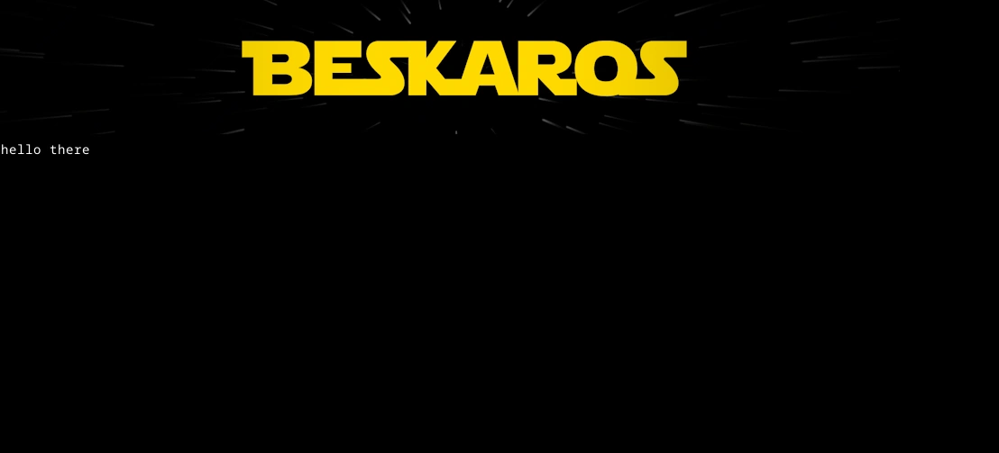

# BeskarOS


This repository contains the Beskar hobby OS: a very basic x86_64 hobby OS written in pure Rust that boots on UEFI 2 and has support for SMP.
It is named after the alloy used to forge Mandalorian armors, which cannot rust.

## Project goals

### Main objectives

Throughout the development process, I always follow four objectives:

1. Getting to grisp with OS development
2. Building a usable general-purpose OS
3. Having it run on real, modern hardware
4. Writing as many things as possible myself

### Achievements

I have many milestones ideas for the OS:

1. Being completely self-hosted
2. Successfully ping `1.1.1.1`
3. Run Doom?

## Design and architecture

- Bootloader: Custom UEFI 2 bootloader
- Kernel: Modern 64-bit kernel with SMP support
- Hyperdrive: Bare metal utility module for the OS
- Beskar Core: Structs and traits common to all modules
- Beskar HAL: Hardware Abstraction Layer
- Beskar Lib: Attempt at writing a standard library

You will find more information in their respective READMEs, especially in `kernel/README.md`, where its features are listed.

## Usage

You can easily use BeskarOS. However, keep in mind that it is currently in a very early stage where it only initializes and prints information.

### Building

The OS can be built using `cargo build [--release]`.
The result of the building process lies inside the `efi_disk` directory.

You can optimize the built files for your specific target CPU. To do so, add the following lines in `.cargo/cargo.toml` :

```toml
[build]
rustflags = ["-C", "target-cpu=<CPU>"]
```

Replace `<CPU>` with any of the CPU listed by `rustc --print target-cpus`.
A great choice for most of modern CPUs is `x86_64-v3` (`v4` if it is very modern), but it is best to set it to the exact architecture you have!

### Running on QEMU

If you want to run the OS on a testing virtual machine on QEMU, you can do so by running the following command :

```powershell
qemu-system-x86_64.exe -drive if=pflash,format=raw,readonly=on,file=<x86_64-OVMF> -drive format=raw,file=fat:rw:efi_disk -smp <NB_CORES> -m <RAM_SIZE> -cpu <CPU_ARCH> -accel <ACCEL_BACKEND> -serial stdio -device qemu-xhci -M q35
```

Where:
- `<x86_64-OVMF>` is the file `<QEMU>/share/edk2-x86_64-code.fd`. Please note that the OVMF file only comes preinstalled on Windows versions of QEMU. You may have to download them on Linux. You will find many tutorials online. It is currently the only way to allow QEMU to use UEFI.
- `<NB_CORES>` must be 1 or more, but setting it to at least 2 is better.
- `<RAM_SIZE>` is in MiB. It must be at least 64.
- `<CPU_ARCH>` specifies the CPU architecture to emulate. QEMU's default amd64 CPU doesn't support some features that are mandatory. A good choice is `max` (Windows) or `host` (Linux), or even `qemu64,+pse,+msr,+apic,+rdrand,+xsave` for minimal features.
- `<ACCEL_BACKEND>` allows QEMU to use acceleration based on your OS. On Linux, you can set it to `kvm`, and to `whpx` on Windows (currently incompatible with OVMF files).

Other useful parameters:
- `-nic user,model=e1000e`: Add a network card to the emulated computer.
- `-device nvme,serial=<anything>`: Add a NVMe controller to the emulated computer.
- `-device usb-kbd`: Add a USB keyboard (currently not recognized). This will disable QEMU's PS/2 emulated keyboard.
- `-device virtio-vga -display <BACKEND>,gl=on`: If having a fixed 2560x1600 resolution bothers you, you can use a better-fitting framebuffer with these options. Replace `<BACKEND>` with either `sdl` or `gtk`.

#### Troubleshooting

If the firmware starts and boots on the UEFI shell instead of the bootloader, try deleting `efi_disk/NvVars`.

If you are using `-accel whpx` and QEMU boots with a blank window right before crashing, remove WHPX acceleration. This a bug with QEMU (apparently, they are not planning on fixing Windows builds of QEMU).

### Running on baremetal

If you want to run the OS on a real baremetal machine, make sure that you have a proper x86_64 machine that supports UEFI 2 and has at least 64 MiB of RAM.
Secure boot must be disabled.

Copy the contents of the `efi_disk` folder to a FAT32 file system, on a GPT (or MBR) partition of a drive, and you're good to go!

#### Warning

Do not run the OS on a machine you care about (at the risk of potentially corrupting your disk if my implementation is incorrect).

#### Troubleshooting

If the bootloader runs but the computer stalls right after (i.e. the screen gets filled with text then turns black), the kernel has likely crashed with an INVALID OPCODE exception very early. Try to build the kernel for an older version of x86_64. If you happen to have a COM1 serial port on your hardware, you can receive debug messages when connecting to it (using PuTTY for example).

In any other cases, the kernel **SHOULD** print explicit information on the screen about any problem it encounters.

## Screenshots

The following screenshots showcase the normal operating of the OS

### Bootloader

Before trying anything, the bootloader checks the firmware version as well as available features. This early process is logged into COM1.



After video is enabled, the bootloader sets up a comfortable environment for the kernel to run, before switching context and jumping to it.



### Kernel

On startup, the kernel initializes itself with the help of information provided by the bootloader.
After initialization, it starts a process to initialize drivers as well as a user-space process for each binary in the ramdisk.



When something goes unfortunately wrong, the faulty process gets killed. On unrecoverable kernel errors, the faulty core sends an NMI to other cores to stop further processing.



### Userspace

For now, the only userspace program is a wanna-be shell. It shows the terrific BeskarOS banner and prints read keys in a loop.



## Sources and inspirations

My warmest thanks to all the [OSDev](https://wiki.osdev.org/) contributors, without whom it would have been impossible to acquire all the information needed to write such code.

Special thanks to Philipp Oppermann, for his [BlogOS ed.3](https://github.com/phil-opp/blog_os) series and for his [bootloader](https://github.com/rust-osdev/bootloader) crate, which enabled me to start from scratch with clear, easy-to-understand explanations.
