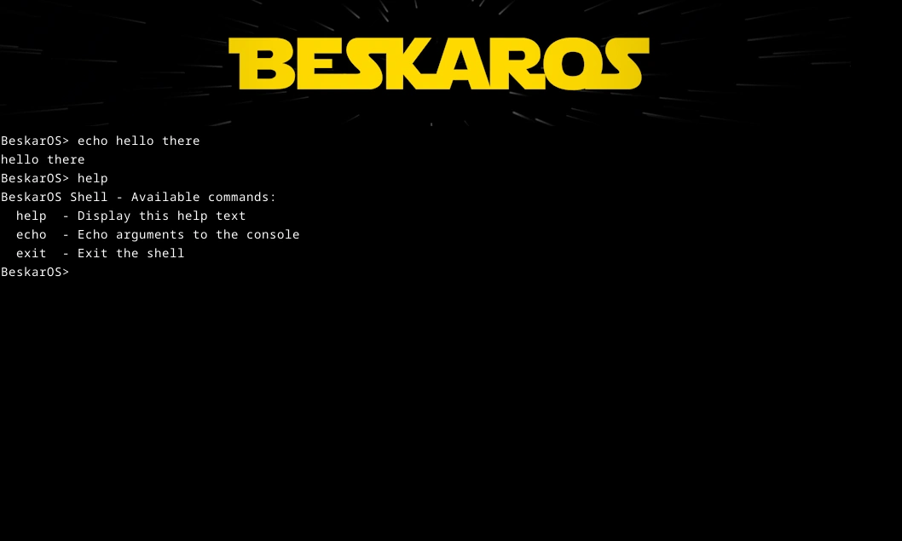

# Bashkar

Bashkar (subtle mix between Beskar and Bash) is BeskarOS's basic shell.

## Usage

Supported commands are:
- `clear`: Clears the screen
- `echo`: Echoes the given arguments
- `exit`: Terminates the shell
- `help`: Prints help information
- `rand`: Generates and prints random bytes

## Screenshots

